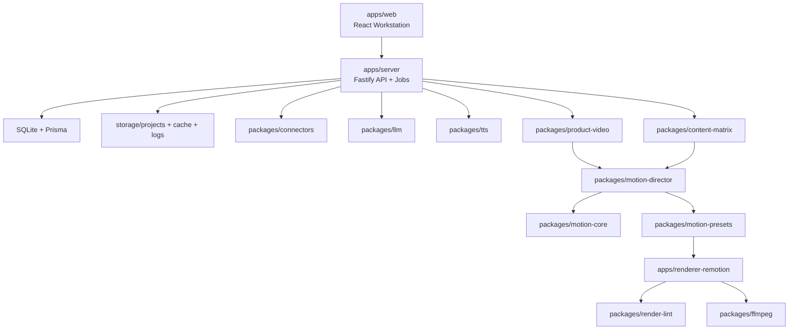

# TrendForge Core Architecture

TrendForge 采用 pnpm monorepo，核心产品是本地自媒体矩阵视频自动化工作台。

## Layers

### Product Layer

- `apps/web`：本地工作台、项目 Studio、设置、日志、渲染结果查看。
- `apps/server`：本地 API、任务系统、Prisma、文件结构、provider 编排。

### Content Layer

- `packages/connectors`：Manual、HN、RSS、Product Hunt、Reddit、X/Twitter。
- `packages/llm`：DeepSeek 和 mock provider。
- `packages/content-matrix`：通用选题分析、候选方案、CreatorStyleAgent、Storyboard。
- `packages/product-video`：Product Hunt 和产品榜单视频流水线。

### Motion Layer

- `packages/motion-core`：MotionGraph 和 VisualSceneSpec 的类型、schema、工具。
- `packages/motion-director`：Storyboard 到 VisualSceneSpec，再到 MotionGraph。
- `packages/motion-presets`：RankRace、ProductWorkspace、DataPulse 等 primitives。
- `packages/render-lint`：字幕安全区、文字溢出、关键帧和画面质量报告。
- `apps/renderer-remotion`：Remotion composition 和本地帧渲染。

### Media Layer

- `packages/tts`：Doubao TTS 和 silent fallback。
- `packages/subtitles`：SRT、ASS、VTT 解析与导出。
- `packages/ffmpeg`：媒体探测、音频替换、字幕烧录、比例裁切、最终 MP4。

## Data Flow

1. 用户创建项目并输入主题、链接或数据源。
2. connectors 抓取热点或生成手动 TrendItem。
3. LLM 或 mock provider 生成内容分析、候选方案、脚本和 CreatorStyleAgent。
4. content/product pipeline 生成 Storyboard DSL。
5. motion-director 生成 VisualSceneSpec 和 MotionGraph。
6. renderer-remotion 渲染画面。
7. tts/subtitles/ffmpeg 生成音频、字幕包和 MP4。
8. render-lint 输出质量报告和关键帧。
9. web 展示结果、日志、重试入口和发布包。

## Public Contracts

- `TrendItem`
- `VideoStoryboard`
- `CreatorStyleAgent`
- `VisualSceneSpec`
- `MotionGraph`
- `RenderLintReport`
- `ProjectRecord`
- `JobRecord`
- `ServiceStatus`

公共契约变更需要同步 schema、测试、API 文档和接力进度。

## Extension Points

- 数据源：实现 `SourceConnector`。
- LLM：实现 `ScriptProvider` 或 content-matrix provider。
- TTS：实现 `TtsProvider`。
- Motion primitive：实现 `MotionPreset`。
- 渲染质量检查：实现 render-lint rule。
- 模板主题：新增 theme tokens 和 responsive 规则。

## Release Gates

- `pnpm typecheck`
- `pnpm test`
- `pnpm build`
- 本地 smoke render
- 关键帧截图检查
- README、配置说明、API 说明、贡献说明更新
