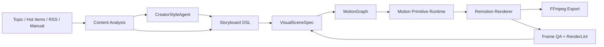

# TrendForge MotionGraph 方案

这份文档给 TrendForge 定下新的本地视频生成路线：用结构化分镜驱动画面，用可复用 motion primitives 生成镜头，用逐帧检查保证质量，用 Remotion 先落地，用 HyperFrames / Revideo / VideoFlow 思路做长期扩展。

## 目标

TrendForge 的目标是服务 AI 自媒体矩阵：同一个选题可以批量生成多条竖屏、横屏、方屏视频，并输出脚本、字幕、封面、发布文案、复盘指标。视频画面由本地代码生成，LLM 负责内容理解、风格提取、镜头意图和文案节奏，本地 renderer 负责画面、动效、字幕、音频和导出。

核心要求：

- 低成本批量：一次选题生成多方案，多平台重复渲染成本稳定。
- 画面可控：事实文本、字幕、安全区、品牌样式、比例适配全部可审查。
- 风格可学习：从爆款博主样本提取 `CreatorStyleAgent`，影响钩子、节奏、镜头语言和字幕密度。
- 场景可扩展：通过 motion primitives 持续增加新视觉能力。
- 质量可量化：每条视频产出 `RenderLintReport` 和关键帧截图，人工审片前先过自动检查。

## 调研结论

成熟工具的共同路线很清晰：

- Remotion 证明 React + CSS / Canvas / SVG / WebGL 可以构建可复用程序化视频组件，并利用变量、函数、API、数学和算法生成效果。参考：[Remotion GitHub](https://github.com/remotion-dev/remotion)。
- HyperFrames 证明 HTML 可以成为 agent 友好的视频定义语言，关键能力是 deterministic render、虚拟时钟、frame-by-frame seek、BeginFrame 捕获。参考：[HyperFrames Introduction](https://hyperframes.video/docs/getting-started/introduction)、[Deterministic Rendering](https://hyperframes.app/docs/2-concepts/4-determinism)。
- Revideo 证明 TypeScript 视频模板、实时预览、headless rendering、并行渲染适合视频应用产品化。参考：[Revideo GitHub](https://github.com/midrender/revideo)。
- Rendervid 证明 JSON 模板、变量、场景、图层、动画预设、转场和 easing 可以服务 AI-driven 批量生产。参考：[Rendervid Template System](https://www.flowhunt.io/rendervid/template-system/)。
- VideoFlow 证明 JSON-first、frame-perfect keyframes、layer groups、GLSL effects、React editor、服务端渲染可以组合成完整视频系统。参考：[VideoFlow](https://videoflow.dev/)。
- Kinetic Typography Diffusion Model 说明专业动态文字的关键指标是审美、运动效果和可读性，专业模板库的价值在于字形、位置、尺寸、飞入、故障、色差、反射等变化组合。参考：[Kinetic Typography Diffusion Model](https://arxiv.org/abs/2407.10476)。
- Motion Canvas / Revideo 的生成器动画思想适合复杂解释型场景：用可组合动作描述动画流。参考：[Motion Canvas Docs](https://motioncanvas.io/docs/)。

TrendForge 吸收这些路线，把“视频作为数据”提升成“视频作为可验证 motion graph”。

## Open Design / HyperFrames 吸收方案

Open Design 的价值在于把设计能力整理成可被 agent 读取的文件系统：`DESIGN.md` 作为品牌合约，skills 作为任务能力，plugins 作为扩展入口，sandbox preview 作为即时验收界面。TrendForge 采用同样的可组合思想，把自媒体视频生产拆成三类可开源资产：

- `MotionFrameDesignSystem`：对应 `DESIGN.md / frame.md`，定义色彩、字体、镜头规则、动效规则、质量规则。
- `MotionTemplateManifest`：对应模板目录 manifest，定义分类、标签、适用场景、输入 schema、输出比例、许可证和来源。
- `MotionDesignPlan`：对应 AI 动态设计指令，DeepSeek 或本地 director 给每个镜头选择 visualType、layoutVariant、templateId、accentIndex、density、motionSignature。

HyperFrames 的价值在于 HTML/CSS/GSAP 的 seekable 合约：同一帧由 `frame/fps` 决定，动画状态可复现，最终经 Headless Chrome 捕获和 FFmpeg 编码。TrendForge 当前先用 `motion-render` 实现纯 MotionGraph → SVG/PNG → FFmpeg 的本地链路，同时保留 `hyperframes` engine adapter：

- `motion-render`：当前 ready，适合低成本矩阵视频和 CI smoke。
- `remotion`：当前 experimental，适合 React component scene 和媒体丰富镜头。
- `hyperframes`：当前 planned，适合 AI 动态生成 HTML/CSS/GSAP 场景、shader transition 和 catalog block 扩展。

html-video 的可吸收点是 `content graph + template manifest + per-frame output`。TrendForge 已把这条思路落到 `ContentGraph`、`MotionTemplateManifest`、`MotionGraph` 三个类型里，后续可以让 DeepSeek 先产出内容图，再由 director 分配镜头和模板，最后由 renderer 逐帧验收。

工程原则：

- AI 负责动态设计计划和分镜意图，本地 renderer 负责可复现画面。
- 模板库负责高质量 motion primitives，DeepSeek 负责组合、取舍和风格变化。
- 字幕保留独立安全区，主体画面进入 visual safe area。
- 每次渲染产出关键帧、lint report、design plan JSON，方便审片、复盘和接力。

## 产品定位

在可灵、即梦、Sora、Veo 这类大模型视频时代，TrendForge 的定位是本地自媒体矩阵生产系统。它擅长信息型、工具型、科普型、新闻解读型、观点型短视频：事实密度高、字幕重要、更新频繁、需要批量、需要可编辑、需要可复盘。

TrendForge 的优势：

- 边际成本低：LLM 主要生成结构化内容和镜头意图，画面由本地 renderer 生成。
- 可复现：同一份 DSL、同一套素材、同一组参数可以复跑。
- 可审稿：每个镜头的事实、字幕、画面元素、口播、来源都能落到数据结构。
- 可矩阵化：一个主题生成 A/B/C 方案、多个平台比例、多个封面标题、多套发布文案。
- 可开源：核心能力来自类型、预设、渲染器、校验器和插件接口。

## 核心架构



### 三层 DSL

1. `Storyboard DSL`

内容导演层，描述主题、口播、字幕、镜头、节奏、转场、平台、候选方案。

关键字段：

- `scene.type`
- `scene.duration`
- `shots[]`
- `shot.beat`
- `shot.camera`
- `shot.transition`
- `shot.onScreenText`
- `shot.brollIntent`
- `captionTrack`
- `audioCue`

2. `VisualSceneSpec`

画面导演层，描述每个镜头要生成哪类视觉场景、用哪些内容槽、哪些安全区、哪些运动意图。

示例：

```ts
export type VisualSceneSpec = {
  id: string;
  sceneId: string;
  shotId: string;
  ratio: Ratio;
  duration: number;
  visualType:
    | "rank-race"
    | "product-workspace"
    | "news-evidence-wall"
    | "data-pulse"
    | "timeline-rail"
    | "workflow-orbit"
    | "creator-desk"
    | "split-compare"
    | "whiteboard-explain";
  contentSlots: {
    headline?: string;
    chips?: string[];
    metrics?: Array<{ label: string; value: string }>;
    entities?: string[];
    quote?: string;
    sourceLabel?: string;
    product?: ProductVideoItem;
  };
  motion: {
    pace: "snap" | "fast" | "steady";
    camera: CameraMove;
    transitionIn: ShotTransition;
    transitionOut: ShotTransition;
    beatSync: boolean;
    intensity: 1 | 2 | 3 | 4 | 5;
  };
  style: {
    themeId: string;
    typography: "bold-news" | "creator-pop" | "documentary" | "clean-explain";
    density: "low" | "medium" | "high";
  };
  safeAreas: {
    title: Box;
    action: Box;
    subtitle: Box;
  };
};
```

3. `MotionGraph`

渲染执行层，描述图层、关键帧、缓动、层组、时间线、遮罩、粒子、字幕、安全区。它是 renderer 的统一输入。

示例：

```ts
export type MotionGraph = {
  id: string;
  width: number;
  height: number;
  fps: number;
  durationFrames: number;
  background: MotionLayer;
  layers: MotionLayer[];
  audio?: MotionAudioTrack[];
  captions?: MotionCaptionTrack[];
  qualityRules: RenderQualityRule[];
};

export type MotionLayer = {
  id: string;
  kind: "text" | "shape" | "image" | "video" | "svg" | "canvas" | "webgl" | "group";
  frame: Box;
  style?: Record<string, string | number>;
  keyframes?: MotionKeyframe[];
  children?: MotionLayer[];
  safeAreaRole?: "title" | "visual" | "caption" | "ui";
};
```

## Motion Primitives

TrendForge 应该内置一组高质量动态场景组件，每个组件都接受 `VisualSceneSpec` 并输出 `MotionGraph`。

首批 primitives：

- `RankRace`：榜单赛道、排名跃迁、产品名短标签、柱状动效、扫光。
- `ProductWorkspace`：产品界面、鼠标轨迹、窗口层级、功能流转、演示路径。
- `NewsEvidenceWall`：新闻证据墙、来源条、时间戳、关联线、风险提示位。
- `DataPulse`：波形、柱状、折线、雷达、数值跳变、节拍脉冲。
- `TimelineRail`：时间线、事件卡、地图线、档案纸张、推拉镜头。
- `WorkflowOrbit`：中心主题、节点环绕、路径连接、状态切换。
- `CreatorDesk`：手机预览、剪辑轨道、麦克风、BGM 波形、发布按钮动势。
- `SplitCompare`：左右对比、前后状态、优劣指标、快速 swipe。
- `WhiteboardExplain`：手绘线、公式块、概念卡、步骤推进。
- `KineticCaption`：关键词 punch、逐词弹入、重音放大、底部字幕安全区。
- `BeatTransition`：whip、flash、zoom、glitch、wipe、match cut。
- `AudioReactiveLayer`：按 BPM / TTS energy 驱动扫光、粒子、波形和 hit flash。

每个 primitive 要提供：

- `input schema`
- `layout rules`
- `responsive rules`
- `safe area rules`
- `animation presets`
- `render-lint rules`
- `golden frame fixtures`

## 画面生成策略

每个镜头由一个主视觉锚点和两个辅助动效构成：

- 主视觉锚点：产品界面、榜单、证据墙、时间线、工作流、数据图。
- 辅助动效 A：扫光、粒子、线条、背景网格、深度层。
- 辅助动效 B：短标签、数值、图标、路径、字幕 punch。

镜头节奏：

- 开场 0-3 秒：给结论、给冲突、给收益，镜头切换 0.8-1.2 秒。
- 中段解释：每 1.2-1.8 秒切换视觉焦点，每个镜头只表达一个信息点。
- 产品拆解：先露界面，再露功能路径，再露适用人群，再给判断。
- 收束：关键词回收、发布行动、下一条选题钩子。

字幕规则：

- 底部字幕固定独立层，主画面全部收进 visual safe area。
- 竖屏字幕每行 10-14 个中文字符，最多 2 行。
- 关键词 punch 出现在标题区或画面中部，底部字幕只做口播承载。
- 英文副字幕在竖屏默认收起，横屏可开启。

文字规则：

- 一个画面最多一个主标题、三个短标签、一个辅助指标组。
- 画面层承载名词和数字，口播承载解释句。
- 产品名、数据、关键词可以大，长句进入字幕和脚本文案。

动效规则：

- 每个镜头至少有一个 camera move、一个 foreground motion、一个 background motion。
- 每个场景至少出现一次转场变化，候选视频之间使用不同转场组合。
- 每 4-6 秒出现一次视觉奖励：rank jump、data spike、cursor click、flash hit、match cut。

## CreatorStyleAgent

新增的“博主风格提取”能力应该变成正式 agent，承担镜头、节奏、字幕和爆点策略。

输入：

- 爆款视频标题
- 文案 / 字幕 / 转写稿
- 视频链接和手动指标
- 用户上传的封面截图或关键帧
- 同类账号样本集合

输出：

```ts
export type CreatorStyleAgent = {
  id: string;
  name: string;
  niche: string;
  hookPatterns: string[];
  narrativeRhythm: string[];
  sentenceRules: string[];
  sceneRules: string[];
  subtitleRules: string[];
  visualRules: string[];
  audioRules: string[];
  viralMechanics: string[];
  pacing: {
    hookSeconds: number;
    sceneSeconds: number;
    totalSeconds: number;
    density: "low" | "medium" | "high";
  };
  directorPolicy: {
    preferredVisualTypes: VisualSceneSpec["visualType"][];
    transitionBias: ShotTransition[];
    cameraBias: CameraMove[];
    textDensity: "low" | "medium" | "high";
    captionPunchRate: number;
  };
  skillMarkdown: string;
};
```

风格提取维度：

- 钩子：提问、反差、结论先行、利益点、情绪点。
- 节奏：短句比例、停顿位置、转折频率、信息密度。
- 镜头：口播、图解、证据、产品界面、数据、对比。
- 字幕：关键词高亮、断句方式、重音词、emoji 使用策略。
- 音频：BGM 情绪、SFX 密度、节拍切点、口播语速。
- 爆点：观众会转发、收藏、评论、关注的触发器。

生成流程：

1. 从样本提取 `CreatorStyleAgent`。
2. 生成选题候选时使用 agent 的 `hookPatterns` 和 `viralMechanics`。
3. 生成分镜时使用 agent 的 `sceneRules` 和 `directorPolicy`。
4. 生成字幕时使用 agent 的 `subtitleRules`。
5. 渲染时用 agent 的 `preferredVisualTypes` 和 `captionPunchRate` 影响 MotionGraph。

## RenderLint

RenderLint 是 TrendForge 画面质量的自动审片器。

检查项：

- `subtitleSafeAreaPass`：字幕层和主画面元素的矩形关系。
- `textOverflowPass`：标题、标签、按钮、字幕的文字溢出。
- `contrastPass`：前景文字和背景的对比度。
- `motionEnergyPass`：关键帧之间的像素变化量，检查静止画面比例。
- `sceneVarietyPass`：相邻场景 visualType、camera、transition 的变化度。
- `captionDensityPass`：字幕字符数、行数、停留时长。
- `brandConsistencyPass`：字体、颜色、圆角、阴影、图标使用。
- `goldenFramePass`：封面、开场、中段、结尾关键帧截图。

输出：

```ts
export type RenderLintReport = {
  jobId: string;
  score: number;
  issues: Array<{
    id: string;
    severity: "info" | "warn" | "error";
    sceneId?: string;
    shotId?: string;
    frame?: number;
    message: string;
    suggestion: string;
  }>;
  frameSamples: Array<{
    frame: number;
    path: string;
    hash: string;
  }>;
};
```

## 技术落地

### 新增包

- `packages/motion-core`
  - `VisualSceneSpec`
  - `MotionGraph`
  - `MotionLayer`
  - `MotionKeyframe`
  - `RenderLintReport`
  - Zod schema 和测试

- `packages/motion-presets`
  - motion primitives
  - scene builders
  - style themes
  - responsive layout rules

- `packages/motion-director`
  - Storyboard -> VisualSceneSpec
  - CreatorStyleAgent -> director policy
  - VisualSceneSpec -> MotionGraph

- `packages/render-lint`
  - frame sampler
  - layout checker
  - text checker
  - motion energy checker
  - report writer

### 改造现有模块

- `packages/core`
  - 保留通用业务类型
  - 抽出 motion 类型到 `motion-core`

- `packages/content-matrix`
  - 输出 `Storyboard DSL`
  - 接入 `CreatorStyleAgent`
  - 调用 `motion-director` 生成 `VisualSceneSpec`

- `packages/product-video`
  - Product Hunt / 手动内容 / RSS / HN 共用 MotionGraph 生成流程

- `apps/renderer-remotion`
  - 增加 `MotionGraphComposition`
  - 使用 primitives 渲染图层和关键帧
  - 保留现有 storyboard renderer 作为兼容入口

- `apps/server`
  - 增加 render-lint job
  - render job 产出 `mp4 + subtitles + cover + frame samples + lint report`

- `apps/web`
  - 新增 Motion Studio
  - 可查看分镜、VisualSceneSpec、关键帧、质量报告
  - 可编辑字幕安全区、主题、镜头节奏、visualType

## 实施阶段

### P0：方案冻结和类型落地

交付：

- `docs/motiongraph-architecture.md`
- `packages/motion-core`
- Zod schema
- fixtures
- 单元测试

验收：

- Storyboard 可以转换成 VisualSceneSpec。
- VisualSceneSpec 可以转换成 MotionGraph。
- schema 校验错误可读。

### P1：首批高质量 primitives

交付：

- RankRace
- ProductWorkspace
- DataPulse
- WorkflowOrbit
- CreatorDesk
- KineticCaption
- BeatTransition

验收：

- 每个 primitive 支持 9:16、16:9、1:1、4:5。
- 每个 primitive 有 golden frame。
- 竖屏字幕安全区通过检查。

### P2：CreatorStyleAgent

交付：

- 风格样本输入
- 风格分析
- agent 保存和复用
- agent 影响分镜、字幕、visualType、节奏

验收：

- 同一选题使用不同 agent 能生成明显不同的视频结构。
- agent 输出 `skillMarkdown` 可交给其他模型协作。

### P3：RenderLint 和自动复修

交付：

- 字幕重叠检测
- 文字溢出检测
- 静止帧比例检测
- 场景重复度检测
- 自动修复建议

验收：

- 关键帧报告可在 Web UI 查看。
- 失败项能定位 scene / shot / frame。

### P4：矩阵生产和开源质量

交付：

- 批量队列
- 多平台比例导出
- 主题包插件接口
- 文档和示例项目

验收：

- 一个选题可以生成 3 个方案、4 个比例、封面和发布文案。
- 开源贡献者能按文档新增 primitive。

## Claude 协作任务包

Claude 可以优先处理这些边界清晰的任务：

1. `packages/motion-core`
   - 定义 `VisualSceneSpec`、`MotionGraph`、`RenderLintReport`
   - 写 Zod schema
   - 写 fixtures 和 schema 单元测试

2. `packages/motion-director`
   - 实现 `storyboardToVisualSpecs(storyboard, styleAgent)`
   - 实现 `visualSpecToMotionGraph(spec)`
   - 写候选视频 A/B/C 的 visualType 分配策略

3. `packages/render-lint`
   - 实现 text overflow schema 层检查
   - 实现 safe area rectangle 检查
   - 实现 frame sample manifest

4. 文档和示例
   - 写 primitive 开发指南
   - 写 CreatorStyleAgent 样本格式
   - 写 MotionGraph JSON 示例

我这边优先处理：

1. Remotion executor
2. 首批 motion primitives 视觉质量
3. Web UI Motion Studio
4. 本地渲染 smoke test 和关键帧检查

## 立即执行建议

下一步直接新增 `packages/motion-core`、`packages/motion-director`、`packages/motion-presets`、`packages/render-lint`，先让当前 storyboard 通过 MotionGraph 渲染出一条 Product Hunt 竖屏视频。验收以关键帧截图为准：开场、榜单、产品界面、数据脉冲、结尾各取一帧，字幕安全区全部通过。

## 接力进度

这个区域给后续接手的大模型使用。每次完成一段工作，都要更新这里的状态、证据、下一步任务和交接提示词。

### 进度更新 2026-06-05 16:48

完成：

- Open Design 风格库正式进入代码：
  - 新增 `packages/motion-presets/src/open-design.ts`。
  - 内置 `BlockFrame`、`Biennale Yellow`、`Bold Poster`、`Data Drift` 四套 `OpenDesignMotionSystem`。
  - 每套系统包含 `stylePrompt`、palette、typography、frameRules、motionRules、qualityRules、templateBias、origin。
  - `MotionFrameDesignSource` schema 增加 `open-design`。
- 本地设计 director 改为从 Open Design 风格库生成 `MotionDesignPlan`：
  - `candidate a` 走 BlockFrame / Bold Poster。
  - `candidate b` 走 Data Drift。
  - `candidate c` 走 Biennale Yellow / Bold Poster。
  - `sourceRefs` 写入 `nexu-io/open-design` 来源。
- 渲染器加入 Open Design palette：
  - `od-blockframe`
  - `od-biennale-yellow`
  - `od-bold-poster`
  - `od-data-drift`
  - 纸面类系统走 warm paper / hard border 背景，Data Drift 保留深色数据面板。
- API 扩展：
  - `GET /api/motion/templates` 返回 `engines`、`templates`、`designSystems`。
  - 前端 `MotionTemplateRegistry` 类型同步。
- `data-pulse` 视觉重写：
  - 抽象彩色柱状图已替换成语义化热度看板。
  - 看板行绑定产品名 / 关键词，包含热度分、推荐理由、可讲性进度条。
  - 过滤 `Product Hunt` 来源词，保留真实产品或关键词。
  - 底部判断条移出字幕安全区。
  - 删除右侧裁边 badge。
- `rank-race` 首名徽章固定高对比色，避免黑底黑字。

验证：

- 命令：`pnpm --filter @trendforge/motion-core typecheck`
- 结果：通过。
- 命令：`pnpm --filter @trendforge/motion-core test`
- 结果：2 files / 6 tests 通过。
- 命令：`pnpm --filter @trendforge/motion-presets typecheck`
- 结果：通过。
- 命令：`pnpm --filter @trendforge/motion-presets test`
- 结果：2 files / 4 tests 通过。
- 命令：`pnpm --filter @trendforge/motion-director typecheck`
- 结果：通过。
- 命令：`pnpm --filter @trendforge/motion-director test`
- 结果：1 file / 1 test 通过。
- 命令：`pnpm --filter @trendforge/server typecheck`
- 结果：通过。
- 命令：`pnpm --filter @trendforge/web typecheck`
- 结果：通过。
- 命令：`pnpm --filter @trendforge/llm test`
- 结果：2 files / 2 tests 通过。
- 命令：`node --import tsx/esm scripts/render-motion-smoke.ts`
- 结果：14/14 PNG，avg lint 100/100。
- 肉眼检查：`data-pulse` 已变成可读的热度看板，`rank-race` 徽章可读，字幕安全区保持干净。

当前问题：

- `workflow-orbit` 和 `creator-desk` 仍是较基础的程序化图形，需要 Open Design 风格化重写。
- Open Design 风格库当前是精简内置版，后续可按 `DESIGN.md` 文件格式做成可插拔目录。
- HyperFrames adapter 仍处于 planned，下一段要给 `BlockFrame` 产出可 seek 的 HTML/CSS/GSAP composition。

下一步：

1. 把 `workflow-orbit` 改成语义化流程图：节点代表采集、脚本、配音、字幕、发布、复盘。
2. 把 `creator-desk` 改成真实创作者工作台：手机预览、时间线、音轨、字幕条、导出按钮。
3. 在 Web UI Motion Studio 展示 `designSystems`，支持切换 Open Design 风格系统。
4. 新增 `docs/open-design-absorption.md`，沉淀吸收规则、许可证和设计系统扩展格式。
5. 实现 HyperFrames adapter 第一版，输出 `DESIGN.md snapshot + index.html + motion plan`。

建议接手提示：

> Open Design 已进入 TrendForge 代码内核：`openDesignMotionSystems` 提供风格系统，local director 用它生成 `MotionDesignPlan`，renderer 已识别 `od-*` palette，`data-pulse` 已从抽象图形改为语义热度看板。下一段继续把 `workflow-orbit`、`creator-desk` 做成内容驱动画面，并让 UI 能选择这些设计系统。

### 进度更新 2026-06-05 16:32

完成：

- 研究并吸收 `nexu-io/open-design`、`nexu-io/html-video`、`heygen-com/hyperframes` 的关键结构：
  - Open Design：`DESIGN.md` 品牌合约、skills 文件系统、design systems、sandbox preview、HyperFrames / MP4 artifact。
  - html-video：content graph、template manifest、per-frame HTML / render output、模板 provenance。
  - HyperFrames：HTML data attributes、GSAP paused timeline、frame adapter、deterministic seek、lint / inspect / validate。
- `packages/motion-core` 新增正式类型：
  - `MotionEngineAdapterSpec`
  - `MotionTemplateManifest`
  - `ContentGraph`
  - `MotionFrameDesignSystem`
  - `MotionDesignPlan`
  - `MotionSceneDesign`
- `packages/motion-presets` 新增模板 manifest 和 engine adapter registry：
  - `motion-render` ready。
  - `remotion` experimental。
  - `hyperframes` planned。
  - `GET /api/motion/templates` 已暴露给前端。
- `packages/motion-director` 新增动态设计层：
  - `createLocalMotionDesignPlan()`
  - `applyMotionDesignPlan()`
  - 本地 seed 设计 director 可生成 `paper-ink.frame-md`、`product-deep.design-md`、`minimal-visual.design-md`。
- `packages/llm` 新增动态设计 provider：
  - `LocalMotionDesignProvider`
  - `DeepSeekMotionDesignProvider`
  - DeepSeek 返回 JSON，经 `motionDesignPlanSchema` 校验。
  - 缺 Key 时走本地设计 director。
- `apps/server` 的 `/api/projects/:id/motion/render` 已接入动态设计 provider，并把 `motion-design-<candidate>.json` 写入项目 render 目录。
- `apps/web` 的候选导出调用已指向 `/api/projects/:id/motion/render`。
- `paper-ink` 首版 frame.md 风格落地：
  - 暖纸背景、硬边框、贴纸色块、粗黑标题、偏移卡片、字幕安全区分隔线。
  - `rank-race`、`product-workspace`、`data-pulse`、`split-compare`、`timeline-rail` 已有 paper 专属版式。
  - 修复 `data-pulse` 标题和顶部贴纸冲突，修复 `split-compare` 空框问题，修复 `timeline-rail` 文本截断。
- `packages/llm/package.json` 补充 `@trendforge/motion-presets` devDependency。
- 重新生成 Prisma Client，server 类型检查恢复。

验证：

- 命令：`pnpm install --config.confirmModulesPurge=false`
- 结果：成功。
- 命令：`pnpm --filter @trendforge/server prisma:generate`
- 结果：成功，Prisma Client v6.1.0 生成。
- 命令：`pnpm --filter @trendforge/motion-core test`
- 结果：2 files / 6 tests 通过。
- 命令：`pnpm --filter @trendforge/motion-director test`
- 结果：1 file / 1 test 通过。
- 命令：`pnpm --filter @trendforge/motion-presets test`
- 结果：2 files / 3 tests 通过。
- 命令：`pnpm --filter @trendforge/motion-presets typecheck`
- 结果：通过。
- 命令：`pnpm --filter @trendforge/llm test`
- 结果：2 files / 2 tests 通过。
- 命令：`pnpm --filter @trendforge/server typecheck`
- 结果：通过。
- 命令：`pnpm --filter @trendforge/web typecheck`
- 结果：通过。
- 命令：`node --import tsx/esm scripts/render-motion-smoke.ts`
- 结果：14/14 PNG，avg lint 100/100，输出 `storage/cache/motion-smoke/frames/` 和 `motion-design.json`。
- 肉眼检查：`data-pulse`、`split-compare`、`timeline-rail` 的 paper 版式比旧版更饱满，字幕安全区保持独立。

待处理：

1. 给 `workflow-orbit`、`creator-desk` 增加 paper 专属版式，继续扩大画面变化。
2. 增强 RenderLint：加入 pixel-level 文字遮挡、色彩对比、静态帧比例和相邻场景相似度检查。
3. 给 HyperFrames adapter 加第一条可执行路径：`MotionDesignPlan + VisualSceneSpec -> index.html + DESIGN.md snapshot -> HyperFrames render`。
4. 在 Web UI 的 Motion Studio 展示 `motion-design.json`、模板 manifest、关键帧和 lint report。
5. 继续优化中文文案压缩，减少长句进入画面主体。

建议接手提示：

> TrendForge 已进入动态设计链路：DeepSeek / local director 生成 `MotionDesignPlan`，director 把 design plan 应用到 `VisualSceneSpec`，presets 根据 theme 和 scene design 输出 MotionGraph，server 渲染时保存 `motion-design-<candidate>.json`。下一段重点是 paper 专属版式扩展、RenderLint 升级、HyperFrames adapter 第一版。

更新时间：2026-06-05

当前目标：

- 建成 TrendForge 本地自媒体矩阵视频自动化生产工具。
- 近期技术主线是 MotionGraph：`Storyboard DSL -> VisualSceneSpec -> MotionGraph -> Remotion Renderer -> RenderLint -> FFmpeg Export`。
- 视频生成坚持本地程序化画面、可控字幕、可复现渲染、低成本批量、矩阵化发布。

已完成：

- 完成 `docs/motiongraph-architecture.md` 方案文档。
- `docs/rendering-roadmap.md` 已指向 MotionGraph 方案。
- 移除外部图片搜索 Key 依赖的产品方向已写入 roadmap。
- AI 大视频模型提示词包方向已经从代码和文档主线中清理。
- 已创建 `packages/motion-core`：
  - `VisualSceneSpec`
  - `MotionGraph`
  - `MotionLayer`
  - `RenderLintReport`
  - Zod schema
  - 安全区工具
  - 基础 schema 测试
- 已创建 `packages/motion-presets`：
  - `buildMotionGraph(spec)`
  - 首批 visualType 到 MotionLayer 的数据化 presets
  - `rank-race` 基础测试
- 已创建 `packages/motion-director`：
  - `storyboardToVisualSpecs(storyboard)`
  - `visualSpecToMotionGraph(spec)`
  - `createMotionDirectorPlan(storyboard)`
  - Storyboard 到 MotionGraph 的基础测试
- 已创建 `packages/render-lint`：
  - `lintMotionGraph(graph)`
  - subtitle safe area rectangle 检查
  - text overflow 粗略估算
  - caption density 检查
  - frame sample manifest
- 已创建开源规范文档：
  - `CONTRIBUTING.md`
  - `docs/code-standards.md`
  - `docs/core-architecture.md`
- `README.md` 已加入 MotionGraph 新包和核心文档入口。
- `pnpm-lock.yaml` 已补充四个新包的 workspace importer。

进行中：

- `packages/motion-core`、`packages/motion-presets`、`packages/motion-director`、`packages/render-lint` 已通过直接 TypeScript 验证。
- pnpm 安装在当前机器的链接阶段持续超时，`node_modules` 根 symlink 需要完整恢复。
- Vitest 运行受 pnpm 链接缺失影响，当前错误停在缺少 `tinyrainbow` 链接。
- `apps/renderer-remotion` 已有程序化场景探索代码，后续要改成消费 MotionGraph 的 executor。

下一步建议：

1. 恢复 pnpm workspace 安装链接：`pnpm install --config.confirmModulesPurge=false`。
2. 跑四个新包的标准命令：
   - `pnpm --filter @trendforge/motion-core typecheck`
   - `pnpm --filter @trendforge/motion-presets typecheck`
   - `pnpm --filter @trendforge/motion-director typecheck`
   - `pnpm --filter @trendforge/render-lint typecheck`
   - 对应 `test`
3. 新增 `MotionGraphComposition`，让 Remotion 能渲染 `MotionGraph`。
4. 生成 Product Hunt 竖屏 smoke video，抽取关键帧检查：cover、overview、product、data、summary。
5. 更新本区域的进度。

### 进度更新 2026-06-05 14:30

完成（MotionGraph 正式接入 server 生产路径，成为主生产链路）：

- 新增 `packages/motion-render/src/sequence.ts`：`renderMotionGraphSequence(graphs, dir)` — 把一组 MotionGraph（每场景一个）渲成连续编号的 PNG 帧序列（`frame_%06d.png`），供 ffmpeg `framesToVideo` 直接消费。纯渲染，只依赖 motion-core + sharp，不碰 ffmpeg。已在 `index.ts` 导出。
- 新增 `apps/server/src/motion-render.ts`：`renderStoryboardMotionFilm()` 编排 `Storyboard → createMotionDirectorPlan → MotionGraph[] → 帧序列 → ffmpeg MP4 → 可选 TTS 混音 → RenderLint 报告`。
- 新增 server 端点 `POST /api/projects/:id/motion/render`（body: `{ candidate, format }`），走 JobRunner，产出 `exports/motion_<candidate>.mp4` 与 `render/motion-lint-<candidate>.json`，并更新 `project.final_video_path`。
- `apps/server/package.json` 增加 `@trendforge/motion-director`、`@trendforge/motion-render`、`@trendforge/render-lint` workspace 依赖。
- 内容映射修复：
  - `motion-director` `chipsFor`：移除 `shot.beat`（如 "切入"）和 broll `query` 搜索串，避免导演内部标签上屏。
  - `motion-presets` `rankRaceLayers`：榜单条改为优先用 `entities`（产品名），chips 仅作回退 —— 修复封面榜单显示 "切入"/日期/"TOP" 的问题。

验证（端到端，真实项目 project_2ce23…，5 产品 9:16）：

- 直接调用 `renderStoryboardMotionFilm`：1140 帧 / 38s / lint 100、产出有效 1.5MB `motion_a.mp4`。
- ffmpeg 抽帧肉眼验收：**无乱码**（中文矢量渲染清晰）、**无缺图**（全程程序化矢量画面：rank-race 封面 → product-workspace → creator-desk → data-pulse）。
- 修复后封面榜单正确显示 `#1 VectorPilot … #5 BuildRadar`。
- HTTP 端点集成：`POST /api/projects/:id/motion/render` 建 job、上报进度、逐帧渲染、ffmpeg 经 `@ffmpeg-installer` bundled 二进制自动发现（`FfmpegService.configuredPath` 已支持）。
- `pnpm --filter @trendforge/motion-director --filter @trendforge/motion-presets test` 通过；smoke 脚本 14/14 帧、avg lint 100。

当前问题 / 下一步：

1. **Web UI 仍触发旧的 `/api/render`（HTML/Puppeteer 截图）路径**——新端点已就绪但前端按钮未指向它。下一步把 `apps/web` 的渲染/导出按钮（或 matrix/product 生成流程）改为调用 `/motion/render`，让用户实际用上 MotionGraph。
2. 内容精修：product-workspace 面板正文仍有截断（"…"），可在 director `headlineFor`/`compact` 与 preset 文本布局上继续优化。
3. 逐帧 sharp 栅格化为单线程，1140 帧约数分钟；后续可并行化或缓存静止段。
4. Remotion CSS 路径（`renderMotionFilm`）仍未集成测试；当前 SVG/PNG 路径已是可用的生产路径。

建议接手提示：

> MotionGraph 已端到端接入 server（`POST /api/projects/:id/motion/render`），SVG→PNG→ffmpeg 路径产出的 MP4 已肉眼验收（无乱码、无缺图，榜单显示真实产品名）。下一段重点：把 Web UI 渲染入口指向新端点，并精修 product-workspace 文本截断。

### 进度更新 2026-06-05 13:30

完成：

- 恢复 pnpm workspace 链接（`pnpm install` 成功，`.bin/vitest` / `.bin/tsc` 软链就位）。
- 新增 `packages/motion-render`：
  - `easing.ts`：7 种缓动函数（linear/ease-in/ease-out/ease-in-out/back-out/expo-out/spring）。
  - `interp.ts`：`sampleTransform(keyframes, frame)` — 确定性关键帧插值核心，与 HyperFrames 虚拟时钟同原理，相同帧总是产出相同变换。
  - `palette.ts`：4 套调色板（tech-signal / news-rank / product-deep / minimal-visual）。
  - `svg.ts`：`renderMotionGraphFrameSvg(graph, frame)` — MotionGraph → SVG 纯函数渲染，支持全部 layer 类型（text/shape/group）、keyframe 入场动画、字幕安全区、背景网格、glow 椭圆、debug stamp。
  - `raster.ts`：`writeMotionGraphFrame` — SVG + sharp 栅格化为 PNG，sharp 不可用时退化到纯 SVG。
  - 6 个单元测试全过。
- 修正 `packages/motion-presets` 三处相对坐标 bug（newsEvidence / timelineRail / splitCompare 的 group children 改为绝对坐标，与 render-lint 平铺层逻辑一致）。
- 修正 `rank-scan` 装饰层侵入字幕安全区（扫光高度上限改为字幕区顶部）。
- 重写 `scripts/render-motion-smoke.ts`：走完整 MotionGraph 管线（Storyboard → createMotionDirectorPlan → MotionGraph → writeMotionGraphFrame → lintMotionGraph），产出 14 张 PNG 帧和 lint 报告。
- 新增 `apps/renderer-remotion/src/compositions/MotionGraphComposition.tsx`：复用 `sampleTransform` 插值核心，用 CSS transform 渲染 MotionLayer，接受原生 MotionGraph 作为 Remotion props。
- 更新 `apps/renderer-remotion/src/Root.tsx`：注册 `MotionGraph` composition（与 `MatrixVideo` 并列）。
- 更新 `apps/renderer-remotion/src/render.ts`：新增 `renderMotionFilm(options)` — 调用 Remotion `MotionGraph` composition 渲染 MP4 和封面帧。
- `tsconfig.base.json` 增加 `@trendforge/motion-render` paths 映射。
- 根目录新增 `tsconfig.json`（extends base）供 tsx 脚本路径解析使用。

验证：

- 命令：`pnpm --filter @trendforge/motion-core --filter @trendforge/motion-presets --filter @trendforge/motion-director --filter @trendforge/render-lint --filter @trendforge/motion-render test`
- 结果：5 包 13 测试全过。
- 命令：`pnpm --filter @trendforge/renderer-remotion typecheck`
- 结果：通过。
- 命令：`node --import tsx/esm scripts/render-motion-smoke.ts`
- 结果：14/14 PNG 生成，avg lint 100/100，输出到 `storage/cache/motion-smoke/frames/`。

当前问题：

- `renderMotionFilm` 调用 Remotion headless Chrome 渲染，当前环境没有直接验证（需要 Chromium 和完整 Node 进程），SVG/PNG 路径已验证为可行的低成本替代和测试路径。
- smoke 脚本产出 14 个 graph（所有镜头），部分重复 visualType（storyboard 的 cover/overview 都路由到 rank-race）；这是 director 决策逻辑的 fallback，不影响功能。

下一步：

1. 扩展 motion-director 的 `chooseVisualType`：给 summary scene 路由到 `workflow-orbit` 或 `creator-desk`，给 cover 路由到 `data-pulse`，增加视觉多样性。
2. 接入 `content-matrix` / `product-video` → motion-director 的完整 server-side 路由（`POST /api/projects/:id/motion/render`）。
3. 跑 Remotion `renderMotionFilm` 集成测试（需 Chromium），验证 CSS 渲染路径与 SVG 路径的视觉一致性。
4. 给 motion-render 增加逐帧动画序列导出（cover/overview/product/summary 各取 5 帧，输出 GIF preview 或帧序列）。
5. 增加 `AudioReactiveLayer` primitive（按 BPM 驱动扫光脉冲）。

建议接手提示：

> 工具链已完全恢复，MotionGraph 管线端到端可运行：SVG/PNG 路径已验证（14 帧 lint 100/100），Remotion CSS 路径已接入但未集成测试（需 Chromium）。下一段重点是增加 visualType 多样性、接入 server-side 渲染端点、跑 Remotion 集成测试。

### 进度更新 2026-06-05 12:01

完成：

- 新增 `CONTRIBUTING.md`、`docs/code-standards.md`、`docs/core-architecture.md`。
- README 增加 MotionGraph 新包和开源规范入口。
- 新增 `packages/render-lint`。
- lockfile importer 增加 `motion-core`、`motion-director`、`motion-presets`、`render-lint`。
- `CreatorStyleAgent` 增加 `visualRules`、`audioRules`、`directorPolicy`。

验证：

- 命令：`node node_modules\.pnpm\typescript@5.9.3\node_modules\typescript\bin\tsc -p packages\motion-core\tsconfig.json --noEmit`
- 结果：通过。
- 命令：`node node_modules\.pnpm\typescript@5.9.3\node_modules\typescript\bin\tsc -p packages\motion-presets\tsconfig.json --noEmit`
- 结果：通过。
- 命令：`node node_modules\.pnpm\typescript@5.9.3\node_modules\typescript\bin\tsc -p packages\motion-director\tsconfig.json --noEmit`
- 结果：通过。
- 命令：`node node_modules\.pnpm\typescript@5.9.3\node_modules\typescript\bin\tsc -p packages\render-lint\tsconfig.json --noEmit`
- 结果：通过。

当前问题：

- `pnpm install --config.confirmModulesPurge=false` 在当前机器链接阶段多次超时。
- Vitest 运行受 incomplete node_modules symlink 影响，当前缺少 `tinyrainbow` 链接。
- 标准 `pnpm --filter ... typecheck/test` 需要 pnpm 链接恢复后复跑。
- Git staging 需要写入 `.git/index`，当前沙箱权限拦截；提升权限请求受当前使用额度限制拦截。

下一步：

1. 完成 pnpm workspace 链接恢复。
2. 跑四个新包标准 typecheck/test。
3. 将 `MotionGraph` 接入 `apps/renderer-remotion`。
4. 加 Product Hunt smoke render 和关键帧报告。
5. 权限恢复后执行 `git add -A`、提交并推送 GitHub。

建议接手提示：

> 先恢复 pnpm workspace 链接，再跑四个新包标准验证。当前代码已经通过直接 TypeScript 验证，下一段重点是把 MotionGraph executor 接进 Remotion，并用 render-lint 输出关键帧质量报告。

接手模型友好提示词：

```text
你正在接手 TrendForge。请先阅读 docs/motiongraph-architecture.md 的「接力进度」区域，再检查当前工作树。

目标是把 TrendForge 做成本地自媒体矩阵视频自动化生产工具。当前核心路线是 MotionGraph：Storyboard DSL 生成 VisualSceneSpec，VisualSceneSpec 生成 MotionGraph，Remotion 渲染 MotionGraph，RenderLint 检查字幕安全区、文字溢出、画面动效和关键帧质量，FFmpeg 输出 MP4、字幕包和封面。

请继续推进代码落地。优先顺序：
1. 修复并验证 packages/motion-core、packages/motion-presets、packages/motion-director。
2. 创建 packages/render-lint。
3. 让 apps/renderer-remotion 支持 MotionGraphComposition。
4. 跑 Product Hunt 竖屏 smoke render，并抽帧检查画面。
5. 每次完成阶段性工作后，更新 docs/motiongraph-architecture.md 的「接力进度」。

产品判断标准：
- 低成本本地生成。
- 画面有镜头语言和动态图形。
- 字幕有独立安全区。
- 文案、分镜、风格 agent、视觉规格、渲染结果都能审查和复跑。
- 生成结果要服务 AI 自媒体矩阵生产。

写代码时优先保持 TypeScript strict、可测试、开源友好。遇到 UI 或画面问题，用关键帧截图作为验收证据。
```

每次交接更新模板：

```md
### 进度更新 YYYY-MM-DD HH:mm

完成：
- 

验证：
- 命令：
- 结果：

当前问题：
- 

下一步：
1. 
2. 
3. 

建议接手提示：
> 
```
